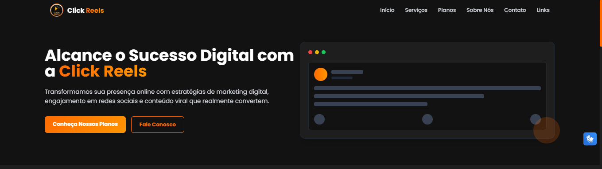

# Click Reels - Marketing Digital & Crescimento Online

> Plataforma profissional de marketing digital especializada em crescimento de redes sociais e criação de conteúdo viral.

## 📌 Visão Geral

A Click Reels é uma agência digital que oferece serviços completos de marketing digital, gestão de redes sociais e criação de conteúdo para impulsionar negócios online. Este projeto consiste no site oficial da agência e em uma página de links (Linktree) para direcionamento rápido aos principais canais.

## ✨ Funcionalidades

- **Site Institucional Moderno**
  - Apresentação dos serviços
  - Planos com diferentes níveis
  - Seção de depoimentos
  - Formulário de contato
  - FAQ interativo

- **Linktree Personalizado**
  - Links rápidos para redes sociais
  - Design consistente com a marca
  - Responsivo para todos os dispositivos

- **Tecnologias Utilizadas**
  - HTML5 semântico
  - CSS3 moderno com TailwindCSS
  - JavaScript para interatividade
  - Integração com VLibras para acessibilidade
  - Animações com AOS (Animate On Scroll)

## 🎨 Design System
Cores Principais
Cor	Hexadecimal
Laranja Primário	#FF6B00
Laranja Secundário	#FF9500
Fundo Escuro	#121212
Fundo Claro	#1E1E1E
Texto	#F5F5F5
Texto Secundário	#AAAAAA
Tipografia
Fonte Principal: Poppins

Hierarquia:

Títulos: 600 (Semibold)

Texto normal: 400 (Regular)

Texto secundário: 300 (Light)

## 📱 Responsividade
O projeto foi desenvolvido com abordagem mobile-first e é totalmente responsivo, adaptando-se a:

Dispositivos móveis (≥375px)

Tablets (≥768px)

Desktops (≥1024px)

Telas grandes (≥1440px)

## 🌐 Hospedagem
O projeto está hospedado na Vercel:
https://clickreels.vercel.app

## 📄 Licença
Este projeto está sob a licença MIT - veja o arquivo LICENSE para detalhes.

## 📧 Contato

**Email:** contato@clickreels.com.br

**WhatsApp:** (11) 94964-8015

**Instagram:** @clickreels_

Desenvolvido por Dérick Campos
